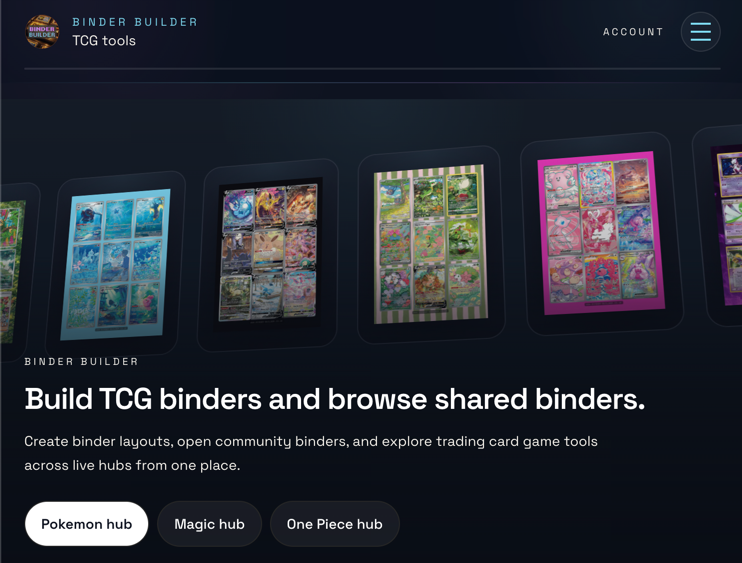
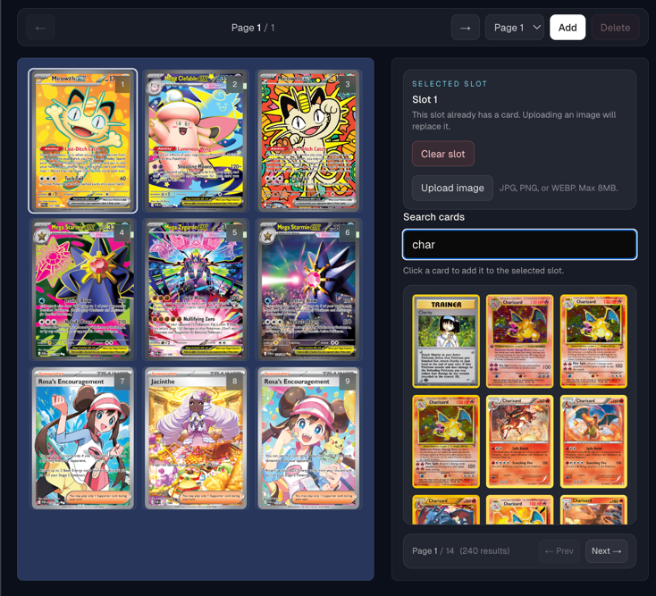
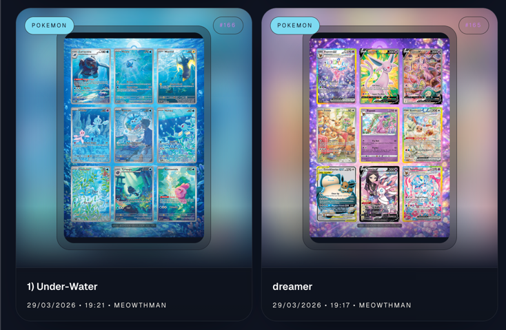
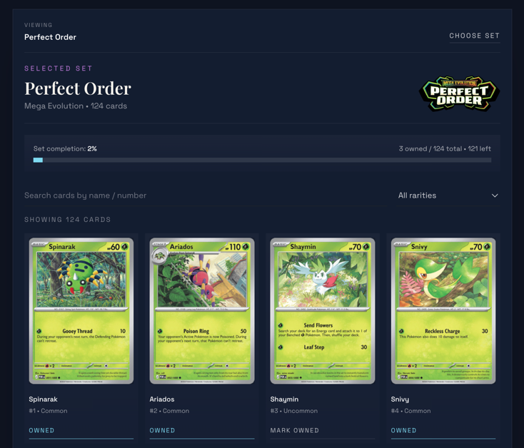

# Binder Builder Showcase

Binder Builder is a multi-TCG workspace for building binder layouts, tracking owned cards inside set archives, and
sharing polished binder pages with the community.

[Visit the website](https://binderbuilder.app) | [TikTok: @binder.builder.tcg](https://www.tiktok.com/@binder.builder.tcg) | [Instagram: @binder.builder](https://www.instagram.com/binder.builder/)

## What Binder Builder Offers Right Now

### 1. Visual Binder Building

Binder Builder lets users search cards and place them into binder slots to build clean, collectible page layouts. The
builder supports multiple pages and different grid sizes, so it works for simple pages as well as more designed showcase
spreads.

### 2. Flexible Binder Layouts

The builder is not locked to one binder format. Users can change pocket layouts, move across pages, switch between edit
and view modes, and build connected-art style pages when they want a more display-driven look.

### 3. Styling and Custom Uploads

Binder pages can be tuned with custom binder names, background colors, patterns, optional background images, and custom
slot images. That makes the experience feel closer to building a presentation piece, not just logging cards.

### 4. Save Drafts and Reopen Them

Signed-in users can save binders to their account, reopen them later, and keep working on layouts over time instead of
rebuilding from scratch.

### 5. Shareable Binder Pages

Binder Builder can generate shareable binder links and publish layouts into public binder galleries. Shared binders get
visual previews, detail pages, and game-specific archive pages so collectors can browse layouts made by the community.

### 6. Set Archives With Owned-Card Tracking

The set viewer is where the tracking side comes in. Users can browse sets, search within a set, and filter by rarity.
Signed-in collectors can mark cards as owned and see completion progress for each set over time.

### 7. Live Multi-TCG Support

The codebase currently supports live hubs for:

- Pokemon
- Magic: The Gathering
- One Piece

Each hub includes a binder builder, card search, set viewing, and shared binder browsing.

Sign-in currently adds the deeper workspace features like saved binders, owned-card tracking, and custom image uploads.

## Current Codebase Snapshot

Verified from the local data files in this codebase on April 7, 2026:

- Pokemon: 172 sets, 20,202 cards
- Magic: The Gathering: 689 sets, 99,479 cards
- One Piece: 48 sets, 3,626 cards

## Product Positioning

Binder Builder already has a clearer story than a normal card checklist:

- It is a binder layout tool first, not just a search page
- It gives collectors a visual way to build and present pages
- It includes real tracking through set ownership and completion
- It adds public sharing, which makes the layouts feel social and collectible
- It now reaches beyond Pokemon with Magic and One Piece live in the product

## Follow and Tag Binder Builder

Use a short CTA like this around the social links:

> Built a page you are proud of? Share your binder layouts, collection progress, pickups, and themed spreads, then tag
> Binder Builder so the community can see them.

- Website: [binderbuilder.app](https://binderbuilder.app)
- TikTok: [@binder.builder.tcg](https://www.tiktok.com/@binder.builder.tcg)
- Instagram: [@binder.builder](https://www.instagram.com/binder.builder/)

## Suggested Roadmap

Draft roadmap based on what the code already points toward:

- Bring queued TCG hubs like Yu-Gi-Oh! and Lorcana fully live
- Expand binder editing with more page templates, layout presets, and page management tools
- Make saved binders and account-level collection progress feel more like a full workspace
- Deepen the public binder side with stronger creator pages and discovery surfaces
- Add better import and export flows for binders and owned-card tracking
- Create more social-ready preview assets for sharing binder pages across TikTok and Instagram
